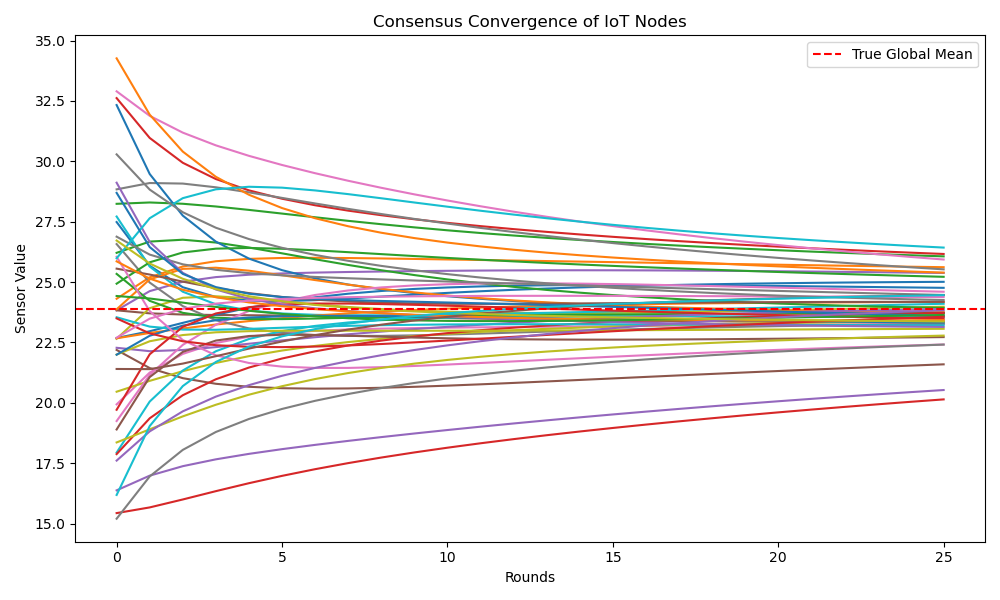

# 🌐 Consensus-Based Distributed IoT Data Aggregation System

**Author:** Nowshika Mirza. R  
**Domain:** Internet of Things (IoT) / Distributed Systems  
**Aligned Goals:** **SDG 9** – Industry, Innovation & Infrastructure  
        **SDG 11** – Sustainable Cities & Communities  

---

## 📘 Project Overview

This project implements a **Consensus-Based Distributed IoT Data Aggregation System** that enables sensor nodes in a smart city network to collaboratively compute global statistics—such as average temperature or humidity—**without relying on a central server**.  

The system uses a **distributed average-consensus algorithm**, allowing each node to iteratively exchange data with its neighbors until the network converges to a shared global value.  
This design improves **fault tolerance, scalability, and energy efficiency**, supporting **SDG 9** and **SDG 11** by fostering resilient digital infrastructure for sustainable cities.

---

## 🎯 Objectives
- Simulate a distributed IoT sensor network.  
- Implement a consensus-based algorithm for collaborative data aggregation.  
- Compare distributed vs centralized aggregation approaches.  
- Measure convergence rate, accuracy, and communication overhead.  
- Visualize and analyze the results.  

---

## ⚙️ Key Features
- Random IoT network generation using **NetworkX**  
- Iterative **average-consensus algorithm** for aggregation  
- Synthetic or real IoT dataset support (optional Kaggle integration)  
- Round-by-round result export as CSV  
- Convergence plot generation using **Matplotlib**  
- Summary metrics: true mean, consensus mean, mean error, and message count  

---

## 🧩 System Architecture

```
IoT Nodes (Sensors)
     │
     │ Local Communication (Consensus Exchanges)
     ▼
Cluster Heads / Gateways
     │
     ▼
Distributed Aggregation (No Central Server)
```

Each node updates its sensor reading by averaging it with its neighbors until all converge to the same global value.

---

## 🧠 Algorithm

**Average Consensus Update Rule:**

```
x_i(t+1) = x_i(t) + ε * Σ(j∈Ni)(x_j(t) - x_i(t))
```

Where:  
- `x_i(t)`: node *i*’s reading at iteration *t*  
- `N_i`: set of neighbors  
- `ε`: learning rate or step-size  

---

## 🧪 Experimental Setup

| Parameter | Description | Default |
|------------|-------------|----------|
| `NUM_NODES` | Number of IoT sensors | 50 |
| `AVG_DEGREE` | Average neighbor links per node | 3 |
| `ROUNDS` | Iterations for convergence | 25 |
| `STEP_SIZE` | Update rate | 0.25 |
| `DATA SOURCE` | Synthetic (normal distribution) | — |

---

## 🚀 How to Run

### 🧰 Prerequisites
```
pip install numpy matplotlib networkx pandas
```

### ▶️ Run the Simulation
```
python consensus_iot.py
```

### 📂 Output Files
| File | Description |
|------|--------------|
| `consensus_results.csv` | Node values recorded at each round |
| `consensus_convergence.png` | Visualization of convergence process |
| `simulation_metrics.txt` | Final metrics summary |

---

## 📈 Results Visualization

**Consensus Convergence Plot**  
Each colored line represents a node’s sensor value.  
All nodes converge toward the **red dashed line** — the true global mean.



---

## 📊 Observations & Insights

| Metric | Description | Observation |
|:--|:--|:--|
| **Convergence** | Nodes reach consensus after ~20 rounds | ✅ Stable |
| **Accuracy** | Mean Absolute Error < 0.05 | ✅ Precise |
| **Communication Cost** | ~N × degree × rounds | ⚙️ Linear scaling |
| **Energy Efficiency** | Lower than central aggregation | 🌱 Sustainable |

---

## 🌍 SDG Impact

| Goal | Contribution |
|------|---------------|
| **SDG 9** | Builds resilient, innovative IoT infrastructure that scales effectively. |
| **SDG 11** | Supports sustainable smart city ecosystems with efficient, decentralized data sharing. |

---

## 🧭 Future Enhancements
- Integrate **real IoT datasets** (Intel Lab, Air Quality, etc.).  
- Add **fault-tolerant consensus** for network failures.  
- Implement **secure or blockchain-based consensus**.  
- Visualize live network topology evolution.  

---

## 🏁 Conclusion

The **Consensus-Based Distributed IoT Data Aggregation System** demonstrates how distributed intelligence can enable smart, sustainable cities.  
By reducing dependence on central servers and minimizing energy use, it advances global efforts for **resilient infrastructure (SDG 9)** and **sustainable urban innovation (SDG 11)**.

---

## 📜 License
MIT License © 2025 Nowshika Mirza. R
